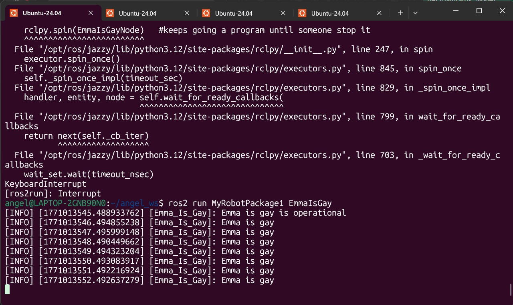

# 📚 Ros2 Topics

> In this assigment I created 2 differente nodes and a service with 2 different topics.

---

## 1) Summary

- **Homework Name:** Ros2 Services 
- **Author:** Angel Ivan Dominguez Cruz 
- **Subject:** Applied Robotics
- **Date:** 17/02/2026 

---

## 2) Objectives

- **General:** Implement and understand the basics of communication in ROS 2 by creating two nodes that interact via a publisher-subscriber model and a service that controls one node.


<p align="center">
  
</p>

---

## 3) First Code: Only Publisher

```bash
import rclpy
from rclpy.node import Node
from example_interfaces.msg import Int64
```

- **Libraries:** The code starts by importing the necessary libraries. It uses rclpy, which is the ROS 2 Python client, and Node from rclpy.node to create the ROS node. The String message type from example_interfaces.msg is imported to send and receive text messages.


```bash
class myNode_function(Node):

    def __init__(self):
        super().__init__('Emma_Is_Gay')    #define the node's name
        self.get_logger().info('Emma is gay is operational')    #confirmation message
        self.num = 1
        self.create_timer(1.0, self.print_callback) #each second timer
        self.publishers_= self.create_publisher(Int64, 'Robot_speaking',10)#crear publisher
```

- **Class Node:** In this section, the class myNode_function is defined, which inherits from Node. This means the class represents a ROS2 node. Inside the function, the node is initialized with the name Emma_Is_Gay and a log message is printed to indicate that the node is active. A variable self.num is initialized to 1. Finally, it sets up a timer to trigger a callback function every 1.0 seconds and creates a publisher to send Int64 messages to the "Robot_speaking" topic with a queue size of 10.


```bash
    def print_callback(self):
        self.get_logger().info('Emma is gay')   #message that is goning to be repeated on the timer
        msg = Int64()
        msg.data = self.num
        self.publishers_.publish(msg)
```

- **Callback to Publish Messages:** The print_callback function is executed every second by the timer created in the previous step. First, it logs the message "Emma is gay" to the console. Then, it creates a new Int64 message object, assigns the value of self.num (which is 1) to the message's data field, and publishes this message to the 'Robot_speaking' topic.


```bash
def main(args=None):
    rclpy.init(args=args)
    EmmaIsGayNode=myNode_function()
    rclpy.spin(EmmaIsGayNode)   #keeps going a program until someone stop it
    rclpy.shutdown()

if __name__=="__main__":
    main()
```

- **Main Execution:** The main function initializes the ROS2 communication (rclpy.init), creates an instance of the myNode_function class, and uses rclpy.spin to keep the node running and listening for callbacks until the program is manually stopped. Finally, it shuts down the ROS 2 client library cleanly.

- **Full Code:**
```bash
#!/usr/bin/env python3

import rclpy
from rclpy.node import Node
from example_interfaces.msg import Int64

class myNode_function(Node):

    def __init__(self):
        super().__init__('Emma_Is_Gay')    #define the node's name
        self.get_logger().info('Emma is gay is operational')    #confirmation message
        self.num = 1
        self.create_timer(1.0, self.print_callback) #each second timer
        self.publishers_= self.create_publisher(Int64, 'Robot_speaking',10)#crear publisher

    def print_callback(self):
        self.get_logger().info('Emma is gay')   #message that is goning to be repeated on the timer
        msg = Int64()
        msg.data = self.num
        self.publishers_.publish(msg)

def main(args=None):
    rclpy.init(args=args)
    EmmaIsGayNode=myNode_function()
    rclpy.spin(EmmaIsGayNode)   #keeps going a program until someone stop it
    rclpy.shutdown()

if __name__=="__main__":
    main()
```

---

## 4) Second Code: Publisher, Subscriber and Server

```bash
#!/usr/bin/env python3

import rclpy
from rclpy.node import Node
from example_interfaces.msg import Int64
from example_interfaces.srv import SetBool 
```

- **Libraries:** The code starts by importing the necessary libraries. It imports the standard rclpy library and the Node class. It imports two different interface types: Int64 for messages (topics) and SetBool (True/False) for the service (server/client communication).


```bash
class myNode_function(Node):

    def __init__(self):
        super().__init__('c3po_node')    #define the node's name
        
        self.acumulado=0

        self.suscriber_ = self.create_subscription(
            Int64,'Robot_speaking',self.listener_callback,10) #create subscriber and link to the callback function
        
        self.server_ = self.create_service(
            SetBool, #Type of the service
            'reset_counter', #Service name
            self.callback_reset_counter
        )
        self.get_logger().info('c3po is operational')    #confirmation message
        self.counter = 0
        self.create_timer(1.0, self.print_callback) #each second timer
        self.publishers_= self.create_publisher(Int64, 'c3po_speaking',10)#crear publisher
```

- **Node Initialization:** In this section, the class myNode_function is defined. Inside "__init__", the node is named "c3po_node". It initializes an accumulator variable (self.acumulado) to 0. It sets up three main communication channels: The subscriber that listens to the "Robot_speaking" topic expecting an Int64 message, the server created with the name "reset_counter" using a SetBool type and a publisher that is prepared to send an Int64 message to the "c3po_speaking" topic.

```bash
    def callback_reset_counter(self, request, response): #Function that will be called when someone calls the service
        if request.data == True: #If petition 'data: true'
            self.acumulado = 0     # Reset counter.
            self.get_logger().info('Resetting counter to 0.')

            response.success = True # We fill the response message
            response.message = "Counter has been reseted." # We fill the response message (appears on the client)
        else:
            self.get_logger().info('Request ignored.')
            response.success = False
            response.message = "Counter was NOT reset"
        
        return response
```

- **Service Callback:** This function is triggered whenever another node calls the "reset_counter" service. It checks the request data (a boolean). If True, it resets self.acumulado to 0 and returns a success message. If False, it ignores the request and returns a failure message. This allows external control over the node's internal state.


```bash
    def listener_callback(self, msg: Int64):
        self.get_logger().info(f'I heard: "{msg.data}"')
        recibido = msg.data #info from the first node
        self.acumulado += recibido
        self.get_logger().info(f'Acumulado: "{self.acumulado}"')
```

- **Subscriber Callback:** The listener_callback function runs every time a message is received on the "Robot_speaking" topic. It logs the incoming data, adds the received integer value to the self.acumulado variable, and logs the new total.

```bash
    def print_callback(self):
        self.get_logger().info('c3po is sending a message')   #message that is goning to be repeated on the timer
        msg = Int64()
        msg.data = self.counter
        self.counter +=1
        self.publishers_.publish(msg)
```

- **Publisher Callback:** The print_callback runs every second (driven by the timer). It creates a new Int64 message, populates it with the current value of self.counter, and publishes it to 'c3po_speaking'. After publishing, it increments self.counter by 1.


```bash
def main(args=None):
    rclpy.init(args=args)
    c3po=myNode_function()
    rclpy.spin(c3po)   #keeps going a program until someone stop it
    rclpy.shutdown()

if __name__=="__main__":
    main()
```

- **Main Execution:** The main function initializes ROS2, creates the c3po_node object, and spins it to keep it active. This ensures the node stays alive to process service requests, subscriptions, and timer callbacks until the user stops the program.

- **Full Code:**
```bash
#!/usr/bin/env python3

import rclpy
from rclpy.node import Node
from example_interfaces.msg import Int64
from example_interfaces.srv import SetBool 


class myNode_function(Node):

    def __init__(self):
        super().__init__('c3po_node')    #define the node's name
        
        self.acumulado=0

        self.suscriber_ = self.create_subscription(
            Int64,'Robot_speaking',self.listener_callback,10) #create subscriber and link to the callback function
        
        self.server_ = self.create_service(
            SetBool, #Type of the service
            'reset_counter', #Service name
            self.callback_reset_counter
        )
        self.get_logger().info('c3po is operational')    #confirmation message
        self.counter = 0
        self.create_timer(1.0, self.print_callback) #each second timer
        self.publishers_= self.create_publisher(Int64, 'c3po_speaking',10)#crear publisher

    def callback_reset_counter(self, request, response): #Function that will be called when someone calls the service
        if request.data == True: #If petition 'data: true'
            self.acumulado = 0     # Reset counter.
            self.get_logger().info('Resetting counter to 0.')

            response.success = True # We fill the response message
            response.message = "Counter has been reseted." # We fill the response message (appears on the client)
        else:
            self.get_logger().info('Request ignored.')
            response.success = False
            response.message = "Counter was NOT reset"
        
        return response
    
    def listener_callback(self, msg: Int64):
        self.get_logger().info(f'I heard: "{msg.data}"')
        recibido = msg.data #info from the first node
        self.acumulado += recibido
        self.get_logger().info(f'Acumulado: "{self.acumulado}"')

    def print_callback(self):
        self.get_logger().info('c3po is sending a message')   #message that is goning to be repeated on the timer
        msg = Int64()
        msg.data = self.counter
        self.counter +=1
        self.publishers_.publish(msg)

def main(args=None):
    rclpy.init(args=args)
    c3po=myNode_function()
    rclpy.spin(c3po)   #keeps going a program until someone stop it
    rclpy.shutdown()

if __name__=="__main__":
    main()
```

---

## 5) Results




---

## 6) Conclusions

- **General:** This code demonstrates a ROS2 communication system involving two nodes interacting through multiple methods. The first node (Emma_Is_Gay) acts as a publisher, broadcasting integer data to the Robot_speaking topic every second. The second node (c3po_node) acts as a subscriber, listening to that topic and accumulating the received values, while simultaneously publishing its own counter to a different topic. Additionally, the second node implements a service server (reset_counter), allowing an external user or node to reset its internal accumulation variable to zero on demand. The diagram of thise excercise is this one:


---