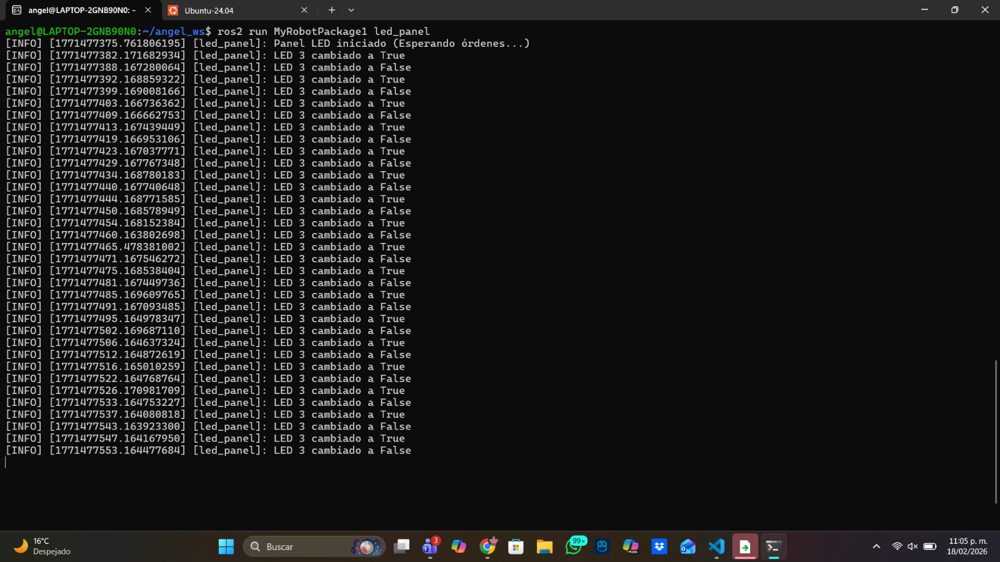

# 📚 Ros2 Custom Services

> In this assignment, I created a custom service interface and two nodes (Battery and LED Panel) that interact as a client-server.

---

## 1) Summary

- **Homework Name:** Ros2 Custom Services (Battery & LED)
- **Author:** Angel Ivan Dominguez Cruz
- **Subject:** Applied Robotics
- **Date:** 19/02/2026

---

## 2) Objectives

- **General:** Understand how to create custom service definitions in ROS 2 and implement a system where a Client node (Battery) controls a Server node (LED Panel).

<p align="center">
  
</p>

---

## 3) Previous Step: Creating the Service Interface

Before writing Python code, we needed to create a "common language" so the nodes could understand each other.

1.  **New Package:** We created a package called `my_robot_interfaces` to hold the definitions.
2.  **The .srv File:** We created a file named `SetLed.srv` with this structure:
    *   **Request:** `int64 led_number` and `bool state`.
    *   **Response:** `bool success`.
3.  **Compilation:** We modified `CMakeLists.txt` and `package.xml` to generate the code. Finally, we compiled it using `colcon build`.

Now, both nodes can import `SetLed` to communicate.

---

## 4) First Code: LED Panel (The Server)

```bash
#!/usr/bin/env python3
import rclpy
from rclpy.node import Node
from my_robot_interfaces.srv import SetLed
from std_msgs.msg import Int64MultiArray
```

- **Libraries:** The code starts by importing the necessary libraries. It imports rclpy, Node, the custom service SetLed (to receive orders) and the message Int64MultiArray to publish the list of LED states.


```bash
class LedPanelNode(Node):
    def __init__(self):
        super().__init__("led_panel")
        self.led_states_ = [0, 0, 0] 
        self.publisher_ = self.create_publisher(Int64MultiArray, "led_panel_state", 10)
        self.timer_ = self.create_timer(1.0, self.publish_led_states)

        self.server_ = self.create_service(SetLed, "set_led", self.callback_set_led)
        
        self.get_logger().info("LED panel initialized")
```

- **Class LedPanelNode:** In this section, the node class is defined. The node is named "led_panel". It initializes a list [0, 0, 0] representing the 3 LEDs off. It creates a publisher to broadcast this status every second to the "led_panel_state" topic. Finally, it creates a Service Server named "set_led" that uses the SetLed type to wait for requests.


```bash
    def publish_led_states(self):
        msg = Int64MultiArray()
        msg.data = self.led_states_ 
        self.publisher_.publish(msg)
```

- **Publish Callback:** This function runs every second controlled by the timer. It creates an Int64MultiArray message, assigns the current list of LEDs to it, and publishes it.

```bash
    def callback_set_led(self, request, response):
        # request.led_number: LED number (1, 2 or 3)
        # request.state: True (on) o False (off)
        
        led_index = request.led_number - 1 #for the index
        
        if 0 <= led_index < len(self.led_states_):
            self.led_states_[led_index] = 1 if request.state else 0
            response.success = True
            self.get_logger().info(f"LED {request.led_number} changing to {request.state}")
        else:
            response.success = False
            self.get_logger().error("Invalid number of LED")
        
        return response
```

- **Service Logic:** This is the main logic of the server. When the Battery node sends a request, this function converts the LED number to an index. It checks if the LED number is valid (1, 2, or 3). If it is valid, it updates the internal list (1 for True, 0 for False) and sends a "Success" response. If invalid, it sends a failure response.

```bash
def main(args=None):
    rclpy.init(args=args)
    node = LedPanelNode()
    rclpy.spin(node)
    rclpy.shutdown()

if __name__ == "__main__":
    main()
```

- **Main Execution:** The main function initializes the ROS2 communication (rclpy.init), creates an instance of the class, and uses rclpy.spin to keep the node running and listening for callbacks until the program is manually stopped. Finally, it shuts down the ROS 2 client library cleanly.

- **Full Code:**
```bash
#!/usr/bin/env python3
import rclpy
from rclpy.node import Node
from my_robot_interfaces.srv import SetLed
from std_msgs.msg import Int64MultiArray

class LedPanelNode(Node):
    def __init__(self):
        super().__init__("led_panel")
        self.led_states_ = [0, 0, 0] 
        self.publisher_ = self.create_publisher(Int64MultiArray, "led_panel_state", 10)
        self.timer_ = self.create_timer(1.0, self.publish_led_states)

        self.server_ = self.create_service(SetLed, "set_led", self.callback_set_led)
        
        self.get_logger().info("Panel LED iniciado (Esperando órdenes...)")

    def publish_led_states(self):
        msg = Int64MultiArray()
        msg.data = self.led_states_
        self.publisher_.publish(msg)

    def callback_set_led(self, request, response):
        led_index = request.led_number - 1
        
        if 0 <= led_index < len(self.led_states_):
            self.led_states_[led_index] = 1 if request.state else 0
            response.success = True
            self.get_logger().info(f"LED {request.led_number} cambiado a {request.state}")
        else:
            response.success = False
            self.get_logger().error("Número de LED inválido")
        
        return response

def main(args=None):
    rclpy.init(args=args)
    node = LedPanelNode()
    rclpy.spin(node)
    rclpy.shutdown()

if __name__ == "__main__":
    main()
```

---

## 5) Second Code: Battery Node

```bash
#!/usr/bin/env python3

import rclpy
from rclpy.node import Node
from my_robot_interfaces.srv import SetLed
```

- **Libraries:** We import rclpy, Node, and the same custom service SetLed. This time, we use the service definition to send requests (as a client).


```bash
class BatteryNode(Node):
    def __init__(self):
        super().__init__("battery_node")
        self.battery_full = True #Starting with a full battery
        self.counter = 0
        self.create_timer(1.0, self.check_battery)#1 second timer
        self.get_logger().info("Batería iniciada.")
```

- **Node Initialization:** The node starts with a "full" battery status and a counter variable at 0. It creates a timer that triggers the check_battery function every second to simulate the battery life cycle.

```bash
    def check_battery(self):
        self.counter += 1
        
        if self.battery_full:
            if self.counter >= 4:#it enters after 4 seconds of being full
                self.get_logger().warn("Empty Battery!")
                self.battery_full = False 
                self.counter = 0 
                self.call_led_service(3, True)#turn on LED 3 when battery is empty
        else:
            if self.counter >= 6:
                self.get_logger().info("Full Battery!")
                self.battery_full = True
                self.counter = 0
                self.call_led_service(3, False)#turn off LED 3 when battery is full
```

- **Battery Logic:** This function simulates the battery draining. It increments a counter every second. After 4 seconds, if the battery was full, it sets it to empty and calls the service to Turn On LED 3. After 6 seconds, if the battery was empty, it sets it to full and calls the service to Turn Off LED 3.


```bash
    def call_led_service(self, led_number, state):
        client = self.create_client(SetLed, "set_led")
        
        while not client.wait_for_service(1.0):
            self.get_logger().warn("Waiting service...")
        
        request = SetLed.Request() #request object for the service (led_number and state)
        request.led_number = led_number
        request.state = state
        
        client.call_async(request)
```

- **Service Call:** This is where the client communicates with the server. It creates a client for the "set_led" service and waits until the LED Panel service is available. It creates a "request object" filling in the led_number (3) and the state (True/False). It sends the request asynchronously (call_async) so the battery timer keeps working without freezing while waiting for a response.


```bash
def main(args=None):
    rclpy.init(args=args)
    node = BatteryNode()
    rclpy.spin(node)
    rclpy.shutdown()

if __name__ == "__main__":
    main()
```

- **Main Execution:** The main function initializes ROS2, creates node object, and spins it to keep it active. This ensures the node stays alive to process service requests, subscriptions, and timer callbacks until the user stops the program.

- **Full Code:**
```bash
#!/usr/bin/env python3
import rclpy
from rclpy.node import Node
from my_robot_interfaces.srv import SetLed

class BatteryNode(Node):
    def __init__(self):
        super().__init__("battery_node")
        self.battery_full = True #Starting with a full battery
        self.counter = 0
        self.create_timer(1.0, self.check_battery)#1 second timer
        self.get_logger().info("Batería iniciada.")

    def check_battery(self):
        self.counter += 1
        
        if self.battery_full:
            if self.counter >= 4:#it enters after 4 seconds of being full
                self.get_logger().warn("Empty Battery!")
                self.battery_full = False 
                self.counter = 0 
                self.call_led_service(3, True)#turn on LED 3 when battery is empty
        else:
            if self.counter >= 6:
                self.get_logger().info("Full Battery!")
                self.battery_full = True
                self.counter = 0
                self.call_led_service(3, False)#turn off LED 3 when battery is full

    def call_led_service(self, led_number, state):
        client = self.create_client(SetLed, "set_led")
        
        while not client.wait_for_service(1.0):
            self.get_logger().warn("Waiting service...")
        
        request = SetLed.Request() #request object for the service (led_number and state)
        request.led_number = led_number
        request.state = state
        
        client.call_async(request)

def main(args=None):
    rclpy.init(args=args)
    node = BatteryNode()
    rclpy.spin(node)
    rclpy.shutdown()

if __name__ == "__main__":
    main()
```

---

## 6) Results




---

## 7) Conclusions

- **General:** This exercise demonstrated how to create a custom communication interface using .srv files. We successfully implemented a Server (LED Panel) that listens for commands and publishes its status, and a Client (Battery) that makes decisions based on time and sends orders to the server. The Client uses asynchronous calls to ensure the timing logic isn't interrupted while waiting for the server.

---