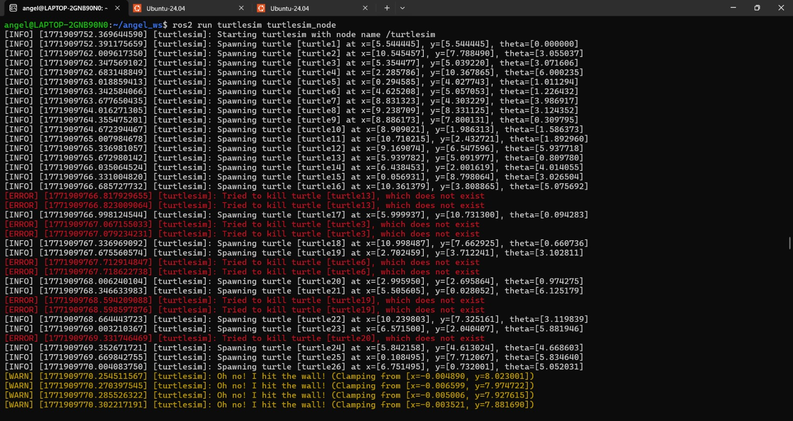

# 📚 Ros2 Turtlesim Catch Them All

> In this assignment, I created a robotic ecosystem using ROS 2. It features a "Spawner" node that generates turtles randomly and a "Controller" node with PID Controller to autonomously hunt them.

---

## 1) Summary

- **Homework Name:** ROS 2 Turtlesim Catch Them All
- **Author:** Angel Ivan Dominguez Cruz
- **Subject:** Applied Robotics
- **Date:** 24/02/2026

---

## 2) Objectives

- **General:** Understand how to integrate multiple ROS 2 concepts simultaneously: custom messages, custom services, dynamic parameters, publishers, subscribers, clients, and servers.

<p align="center">
  
</p>

---

## 3) Previous Step: Creating the Service Interface

Before writing the node logic, we needed to create a custom communication bridge so the Spawner and the Controller could share information about the alive turtles and the catching events.

Inside the my_robot_interfaces package, we created three files:

1.  **Turtle.msg:** Defines the structure of a single turtle.
    ```bash
    string name
    float32 x
    float32 y
    float32 theta
    ```
2.  **TurtleArray.msg:** Defines a list of turtles.
    ```bash
    Turtle[] turtles
    ```
3.  **CatchTurtle.srv:** A service definition used by the controller to tell the spawner which turtle to remove.
    ```bash
    string name
    ---
    bool success
    ```
After modifying CMakeLists.txt and package.xml, we compiled the package using colcon build.

---

## 4) Fisrt Code: Turtle Spawner Node

```bash
#!/usr/bin/env python3
import rclpy
from rclpy.node import Node
import random
import math

from my_robot_interfaces.msg import Turtle, TurtleArray
from turtlesim.srv import Spawn, Kill
from my_robot_interfaces.srv import CatchTurtle
```

- **Libraries:** Imports standard ROS 2 libraries, Python math/random modules, our custom interfaces, and the official Turtlesim services (Spawn and Kill).

```bash
class myNode_function(Node):
    def __init__(self):
        super().__init__('turtle_spawner')
        self.alive_turtles_ = []
        self.publishers_= self.create_publisher(TurtleArray, 'alive_turtles', 10)
        self.counter = 2

        self.create_timer(1.0, self.publish_turtles)

        self.declare_parameter("spawn_frequency", 1.0) 
        self.frequency_ = self.get_parameter('spawn_frequency').value 
        spawn_period = 1.0 / self.frequency_
        self.create_timer(spawn_period, self.spawn_turtle)

        self.spawn_ = self.create_client(Spawn, 'spawn')
        self.kill_ = self.create_client(Kill, 'kill')
        self.catch_turtles_ = self.create_service(CatchTurtle, 'catch_turtle', self.catch_turtle_callback)
```

- **Initialization:** Initializes an empty list of alive turtles and a publisher. It introduces a ROS 2 Parameter (spawn_frequency) that allows us to change how fast turtles spawn directly from the terminal without changing the code. It also sets up clients to talk to Turtlesim and a Server (catch_turtle) to listen to our Controller.


```bash
        def spawn_turtle(self):
        spawn_request = Spawn.Request() 
        spawn_request.x = random.uniform(0.0, 11.0) 
        spawn_request.y = random.uniform(0.0, 11.0) 
        spawn_request.theta = random.uniform(0.0, 2*math.pi) 
        spawn_request.name = f'turtle{self.counter}' 
        self.counter += 1

        future = self.spawn_.call_async(spawn_request)
        future.add_done_callback(
            lambda future_msg: self.spawn_callback(future_msg, spawn_request.x, spawn_request.y, spawn_request.theta)
        )
```

- **Spawning Logic:** Triggered by the timer, this function generates random coordinates and sends an asynchronous request to Turtlesim to spawn a new turtle. It uses a lambda function to pass the coordinates to the callback once the server responds.

```bash
        def catch_turtle_callback(self, request, response):
        kill_request = Kill.Request()
        kill_request.name = request.name
        self.kill_.call_async(kill_request)

        for turtle in self.alive_turtles_:
            if turtle.name == request.name:
                self.alive_turtles_.remove(turtle)
                break

        self.publish_turtles() 
        response.success = True
        return response
```

- **Catch Logic:** When the Controller node catches a turtle, it calls this service. This function asks Turtlesim to Kill (remove) the turtle from the screen, removes it from our internal alive_turtles_ list, and updates the published array.

```bash
def main(args=None):
    rclpy.init(args=args)
    parameters_node=myNode_function()
    rclpy.spin(parameters_node)   #keeps going a program until someone stop it
    rclpy.shutdown()
```

- **Main Execution:** The main function initializes the ROS2 communication (rclpy.init), creates an instance of the class, and uses rclpy.spin to keep the node running and listening for callbacks until the program is manually stopped. Finally, it shuts down the ROS 2 client library cleanly.

- **Full Code:**
```bash
import rclpy
from rclpy.node import Node
import random
import math

from example_interfaces.msg import String
from my_robot_interfaces.msg import Turtle #custom type msg (name, x, y, and theta)
from my_robot_interfaces.msg import TurtleArray #custom type msg (array of turtles)

from turtlesim.srv import Spawn
from turtlesim.srv import Kill
from my_robot_interfaces.srv import CatchTurtle

class myNode_function(Node):

    def __init__(self):
        super().__init__('turtle_spawner')    #define the node's name, used for the yaml file

        self.alive_turtles_ = []
        self.publishers_= self.create_publisher(TurtleArray, 'alive_turtles',10)#crear publisher

        self.counter = 2

        self.get_logger().info('turtle_spawner node is operational')    #confirmation message
        self.create_timer(1.0, self.publish_turtles) #each second timer

        self.declare_parameter("spawn_frequency", 1.0) #declare a parameter with a default value
        self.frequency_ = self.get_parameter('spawn_frequency').value #get the parameter value on the variable frequency_
        spawn_period = 1.0 / self.frequency_
        self.create_timer(spawn_period, self.spawn_turtle)

        self.spawn_ = self.create_client(Spawn, 'spawn')
        self.kill_ = self.create_client(Kill, 'kill')

        self.catch_turtles_ = self.create_service(CatchTurtle, 'catch_turtle', self.catch_turtle_callback)#waits for a request in "catch_turtle" with structure CatchTurtle and executes the function catch_turtle_callback


    def publish_turtles(self):
        msg = TurtleArray()#msg of type TurtleArray, which contains an array of turtles
        msg.turtles = self.alive_turtles_#saving the alive turtles in the msg, the list has to be a Turtle type list
        self.publishers_.publish(msg)

    def spawn_turtle(self):
        spawn_request = Spawn.Request() #request object for the service (x, y, theta, name)
        spawn_request.x = random.uniform(0.0, 11.0) #random x
        spawn_request.y = random.uniform(0.0, 11.0) #random y
        spawn_request.theta = random.uniform(0.0, 2*math.pi) #random
        spawn_request.name = f'turtle{self.counter}' #name of the turtle
        self.counter += 1

        future = self.spawn_.call_async(spawn_request)#call the spawn service with the request, it returns a future object that will contain the response of the service when it is ready

        future.add_done_callback(#when tutlesim service responds, it will execute the spawn_callback function
            lambda future_msg: self.spawn_callback(future_msg, spawn_request.x, spawn_request.y, spawn_request.theta)#future_msg is the response of the service and the other parameters are the ones we sent in the request, we need them to create the turtle in the spawn_callback function
        )

    def spawn_callback(self, future_msg, x, y, theta):
        try:
            response = future_msg.result()
            new_turtle = Turtle()
            new_turtle.name = response.name# /spawn only gives a name
            new_turtle.x = x
            new_turtle.y = y
            new_turtle.theta = theta
            self.alive_turtles_.append(new_turtle)
            self.get_logger().info(f'Turtle {response.name} spawned at ({x}, {y}, {theta})')
        except Exception as e:
            self.get_logger().error(f'Failed to spawn turtle: {e}')

    def catch_turtle_callback(self, request, response):
        kill_request = Kill.Request()#request to /kill
        kill_request.name = request.name#turtle name to kill
        self.kill_.call_async(kill_request)#send the kill request to the service (kill_ is the client for the /kill service)

        for turtle in self.alive_turtles_:
            if turtle.name == request.name:
                self.alive_turtles_.remove(turtle)#delete the turtle from the alive turtles list
                break

        self.publish_turtles() #publish the updated list of turtles after catching one

        self.get_logger().info(f'Turtle {request.name} caught and removed from alive turtles')
        response.success = True
        return response

def main(args=None):
    rclpy.init(args=args)
    parameters_node=myNode_function()
    rclpy.spin(parameters_node)   #keeps going a program until someone stop it
    rclpy.shutdown()
```

---

## 5) Second Code: Turtle Controller Node (PID)

```bash
import rclpy
from rclpy.node import Node
import random
import math

from example_interfaces.msg import String
from my_robot_interfaces.msg import Turtle
from my_robot_interfaces.msg import TurtleArray

from turtlesim.msg import Pose
from geometry_msgs.msg import Twist

from my_robot_interfaces.srv import CatchTurtle
```

- **Libraries:** Just like the spawner, we import standard libraries (rclpy, Node, math) and our custom interfaces. The key additions here are Pose from turtlesim.msg (used to get our exact coordinates) and Twist from geometry_msgs.msg (the universal ROS 2 message for commanding linear and angular velocities to move the robot).


```bash
class myNode_function(Node):
    def __init__(self):
        super().__init__('turtle_controller')

        self.pose = None
        self.integral_linear = 0.0
        self.prev_error_linear = 0.0
        
        self.integral_angular = 0.0
        self.prev_error_angular = 0.0
        
        self.current_target_name = "" 
        
        self.dt = 0.001 

        self.suscriber_alive_turtles = self.create_subscription(
            TurtleArray,'alive_turtles',self.alive_turtles_callback,10) 
        
        self.suscriber_pose = self.create_subscription(
            Pose,'turtle1/pose',self.pose_callback,10) 

        self.alive_turtles_ = []
        
        self.publishers_= self.create_publisher(Twist, 'turtle1/cmd_vel',10)

        self.catch_ = self.create_client(CatchTurtle, 'catch_turtle')

        self.create_timer(0.001, self.control_turtles)

        self.get_logger().info('turtle_controller node is operational')
```

- **Node Initialization:** The node is named "turtle_controller". We initialize self.pose = None to avoid crashing before the first GPS message arrives. We declare variables to store the PID controller memory: integrals (accumulated error) and previous errors, for both linear and angular movements. self.dt = 0.001 represents the time differential. We create two Subscribers (for the alive turtles list and our own pose), one Publisher for the Twist commands, and a Client for the CatchTurtle service. Finally, a fast timer (0.001s) is created to run the control loop.

```bash
        def alive_turtles_callback(self, msg: TurtleArray):
        self.alive_turtles_ = msg.turtles

    def pose_callback(self, msg: Pose):
        self.pose = msg
```

- **Subscriber Callbacks:** Every time the Spawner publishes the array of targets, alive_turtles_callback updates our internal list. Every time the simulator publishes the hunter's coordinates, pose_callback saves the data into self.pose.


```bash
        def control_turtles(self):
        if self.pose is None or len(self.alive_turtles_) == 0:
            return 
        closest_turtle = None
        closest_distance = 1000.0

        for turtle in self.alive_turtles_:
            dist_x = turtle.x - self.pose.x
            dist_y = turtle.y - self.pose.y
            distance = math.sqrt(dist_x**2 + dist_y**2)

            if distance < closest_distance:
                closest_distance = distance
                closest_turtle = turtle

        if closest_turtle is None:
            self.get_logger().info("No closest turtle found.")
            return

        if closest_turtle.name != self.current_target_name:
            self.integral_linear = 0.0
            self.prev_error_linear = 0.0
            self.integral_angular = 0.0
            self.prev_error_angular = 0.0
            self.current_target_name = closest_turtle.name
```

- **Target Lock:** This part of the control loop ensures we have data. Then, it uses the Pythagorean theorem to calculate the distance to all alive turtles and selects the closest one. If the closest turtle is different from our current target, we will change the current target. To avoid erratic movements from old PID memory, it resets the integrals and derivatives to 0.0 and saves the new target's name.

```bash
        if closest_distance < 0.5:
            msg = Twist()
            msg.linear.x = 0.0
            msg.angular.z = 0.0
            self.publishers_.publish(msg)
                       
            request = CatchTurtle.Request()
            request.name = closest_turtle.name
            self.catch_.call_async(request)
            return
```

- **Catch Condition:** If the distance to the target is less than 0.5 units, the robot considers it caught. It immediately publishes a Twist message with 0.0 velocities to stop the hunter. It then prepares a CatchTurtle request with the prey's name and sends it to the Spawner node asynchronously. The function returns early to stop the PID calculations for this cycle.

```bash
        msg = Twist()

        target_angle = math.atan2(closest_turtle.y - self.pose.y, closest_turtle.x - self.pose.x)
        error_angular = target_angle - self.pose.theta

        if error_angular > math.pi:
            error_angular -= 2 * math.pi
        elif error_angular < -math.pi:
            error_angular += 2 * math.pi

        self.integral_angular += error_angular * self.dt 
        derivative_angular = (error_angular - self.prev_error_angular) / self.dt 

        Kp_angular = 2.0
        Ki_angular = 0.1
        Kd_angular = 0.5

        msg.angular.z = Kp_angular * error_angular + Ki_angular * self.integral_angular + Kd_angular * derivative_angular
        self.prev_error_angular = error_angular

        error_linear = closest_distance
        self.integral_linear += error_linear * self.dt
        derivative_linear = (error_linear - self.prev_error_linear) / self.dt 

        Kp_linear = 1.0
        Ki_linear = 0.1
        Kd_linear = 0.5

        msg.linear.x = Kp_linear * error_linear + Ki_linear * self.integral_linear + Kd_linear * derivative_linear
        self.prev_error_linear = error_linear

        self.publishers_.publish(msg)
```

- **PID Controller:** 
- *Angular (Steering):* It uses atan2 to find the desired angle and calculates the error. It standardizes the error between -π and π to take the shortest path. It applies numerical integration (multiplying error by dt) and derivation (rate of change over dt). It applies the Gains (Kp, Ki, Kd) and assigns the result to the angular velocity (msg.angular.z).
- *Linear (Accelerator):* The error is simply the distance. It calculates its integral and derivative (the braking effect before a crash). It applies its respective Gains and assigns the result to the linear velocity (msg.linear.x). Finally, it publishes the movement.
```bash
def main(args=None):
    rclpy.init(args=args)
    parameters_node=myNode_function()
    rclpy.spin(parameters_node)   
    rclpy.shutdown()

if __name__ == '__main__':
    main()
```

- **Main Execution:** The main function initializes ROS 2, creates the node object, and spins it to keep the 0.001s control loop timer active. This ensures the PID controller evaluates the math continuously until the user stops the program.

- **Full Code:**
```bash
import rclpy
from rclpy.node import Node
import random
import math

from example_interfaces.msg import String
from my_robot_interfaces.msg import Turtle #custom type msg (name, x, y, and theta)
from my_robot_interfaces.msg import TurtleArray #custom type msg (array of turtles)

from turtlesim.msg import Pose
from geometry_msgs.msg import Twist

from my_robot_interfaces.srv import CatchTurtle

class myNode_function(Node):

    def __init__(self):
        super().__init__('turtle_controller')    #define the node's name, used for the yaml file

        self.pose = None
        self.integral_linear = 0.0
        self.prev_error_linear = 0.0
        
        self.integral_angular = 0.0
        self.prev_error_angular = 0.0
        
        self.current_target_name = "" #for saving the name of the turtle we are trying to catch, so we don't change the target until we catch it or it disappears
        
        self.dt = 0.001 #our control loop runs every 0.01 seconds, so dt is 0.01 for the PID controller

        self.suscriber_alive_turtles = self.create_subscription(
            TurtleArray,'alive_turtles',self.alive_turtles_callback,10) #create subscriber to alive_turtles
        
        self.suscriber_pose = self.create_subscription(
            Pose,'turtle1/pose',self.pose_callback,10) #create subscriber to turtle_pose

        self.alive_turtles_ = []
        
        self.publishers_= self.create_publisher(Twist, 'turtle1/cmd_vel',10)#crear publisher

        self.catch_ = self.create_client(CatchTurtle, 'catch_turtle')#client for the catch_turtle service, we will use it to catch turtles from this node

        self.create_timer(0.001, self.control_turtles)

        self.get_logger().info('turtle_controller node is operational')#confirmation message


    def alive_turtles_callback(self, msg: TurtleArray):
        self.alive_turtles_ = msg.turtles

    def pose_callback(self, msg: Pose):
        self.pose = msg

    def control_turtles(self):
        if self.pose is None or len(self.alive_turtles_) == 0:#if we don't have the pose of our turtle or there are no alive turtles, return and do nothing
            return 
        closest_turtle = None
        closest_distance = 1000.0#a huge number

        for turtle in self.alive_turtles_:
            #Calculate the distance from our turtle to each alive turtle
            dist_x = turtle.x - self.pose.x
            dist_y = turtle.y - self.pose.y
            distance = math.sqrt(dist_x**2 + dist_y**2)

            if distance < closest_distance:
                closest_distance = distance
                closest_turtle = turtle

        if closest_turtle is None:
            self.get_logger().info("No closest turtle found.")
            return

        if closest_turtle.name != self.current_target_name:#if the closest turtle is different, we creset the PID. Current target starts as an empty string, so the if will enter in the first iteration
            self.integral_linear = 0.0
            self.prev_error_linear = 0.0
            self.integral_angular = 0.0
            self.prev_error_angular = 0.0
            self.current_target_name = closest_turtle.name

        if closest_distance < 0.5:#if the closest turtle is less than 0.5 units away, we catch it
            msg = Twist()#msg of type Twist, which contains linear and angular velocities
            msg.linear.x = 0.0
            msg.angular.z = 0.0
            self.publishers_.publish(msg)
                       
            request = CatchTurtle.Request()
            request.name = closest_turtle.name
            self.catch_.call_async(request)
            return

        msg = Twist()

        target_angle = math.atan2(closest_turtle.y - self.pose.y, closest_turtle.x - self.pose.x)#angle to the target turtle
        error_angular = target_angle - self.pose.theta#error between the angle to the target and our turtle's angle

        if error_angular > math.pi:#standardize the error to be between -pi and pi, so we take the shortest path
            error_angular -= 2 * math.pi
        elif error_angular < -math.pi:
            error_angular += 2 * math.pi

        self.integral_angular += error_angular * self.dt #numeric method for the integral (thanks Oscar Fountains)
        derivative_angular = (error_angular - self.prev_error_angular) / self.dt #the speed at which the error is changing. Numeric method for the derivative (thanks Oscar Fountains)

        Kp_angular = 2.0
        Ki_angular = 0.1
        Kd_angular = 0.5

        msg.angular.z = Kp_angular * error_angular + Ki_angular * self.integral_angular + Kd_angular * derivative_angular#angular msg of twist
        self.prev_error_angular = error_angular#save the error for the next iteration

        error_linear = closest_distance#the error for the linear velocity is the distance to the target
        self.integral_linear += error_linear * self.dt#the distance error integrated over time, it increases when we are far from the target and decreases when we are close
        derivative_linear = (error_linear - self.prev_error_linear) / self.dt #the speed at which the distance error is changing

        Kp_linear = 1.0
        Ki_linear = 0.1
        Kd_linear = 0.5

        msg.linear.x = Kp_linear * error_linear + Ki_linear * self.integral_linear + Kd_linear * derivative_linear#linear msg of twist
        self.prev_error_linear = error_linear#save the error for the next iteration

        self.publishers_.publish(msg)

def main(args=None):
    rclpy.init(args=args)
    parameters_node=myNode_function()
    rclpy.spin(parameters_node)   #keeps going a program until someone stop it
    rclpy.shutdown()
```

---

## 6) Results




---

## 7) Conclusions

- **General:** We built a fully autonomous system, a very big challenge for our programming skills. We learned how to manage robot states dynamically and applied real-world Calculus to solve robotic problems through a PID Controller. The resulting movement is optimized, and independent of processor speed thanks to the proper use of the time differential (dt) in our mathematical integrations.

---