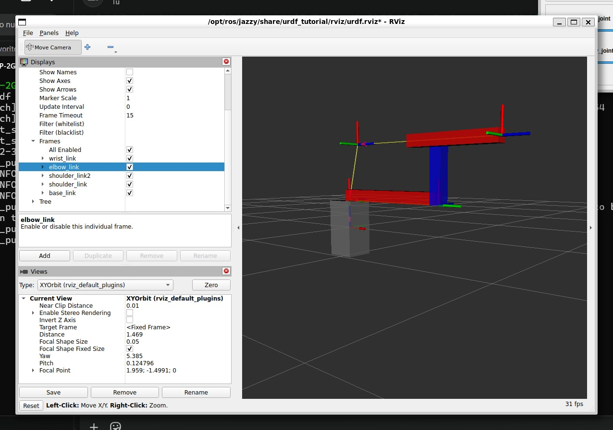
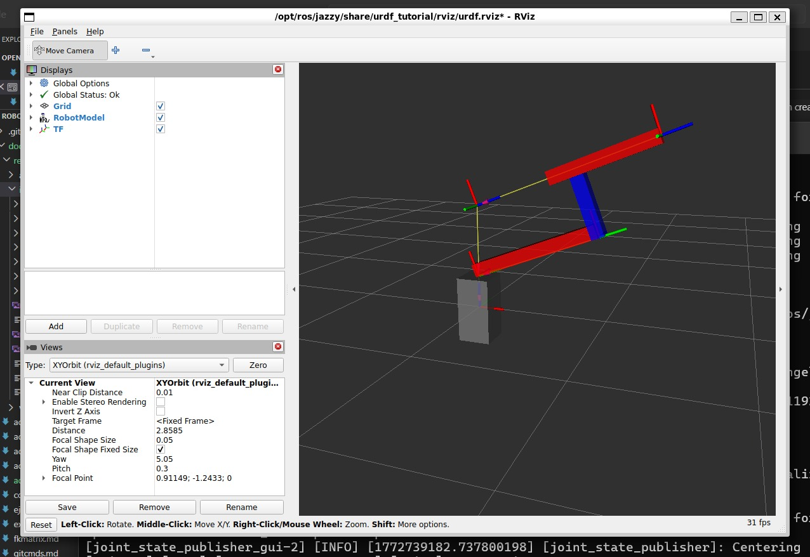
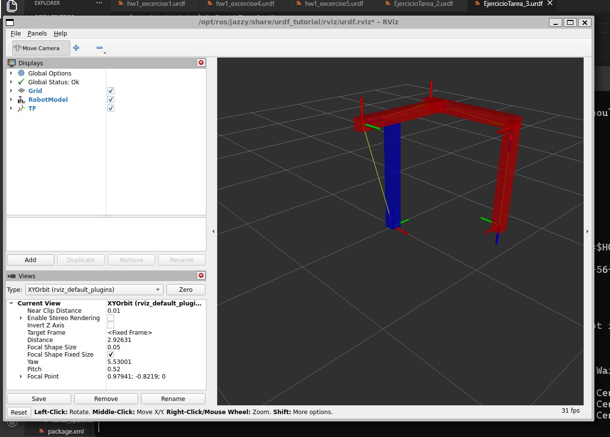
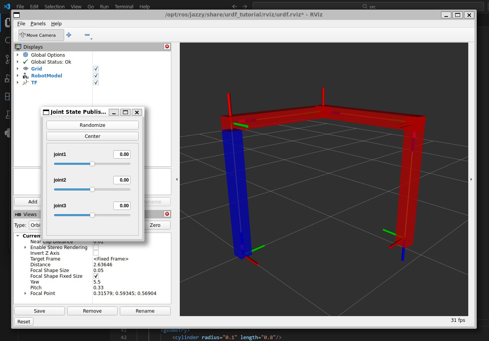
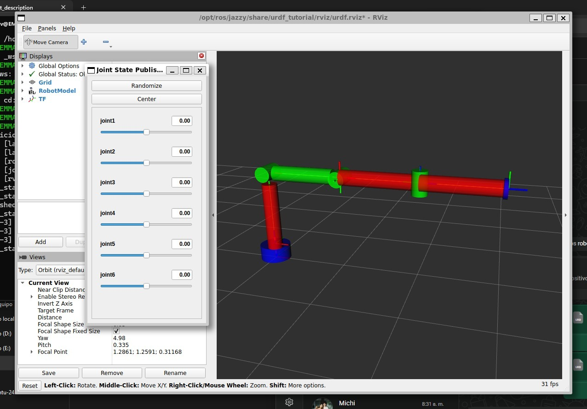
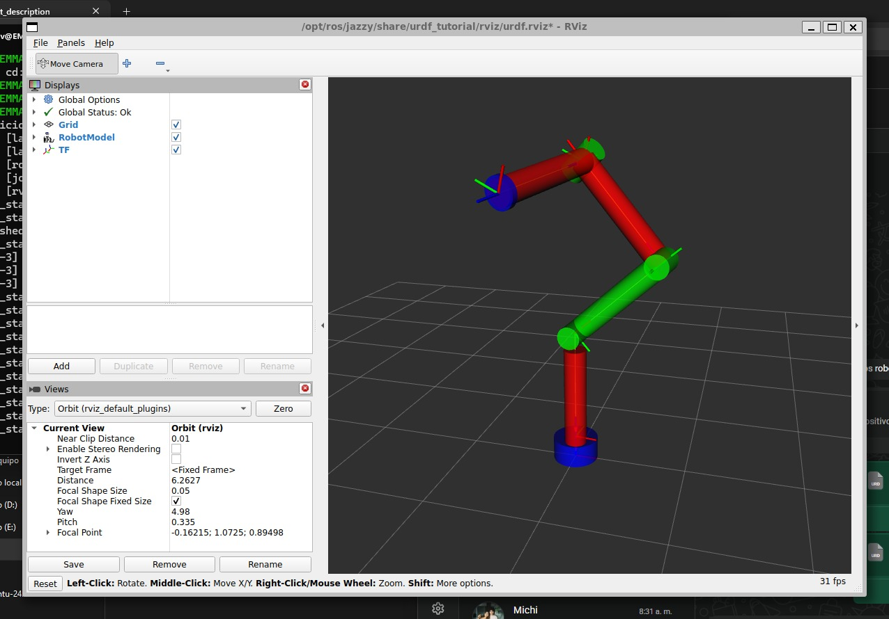
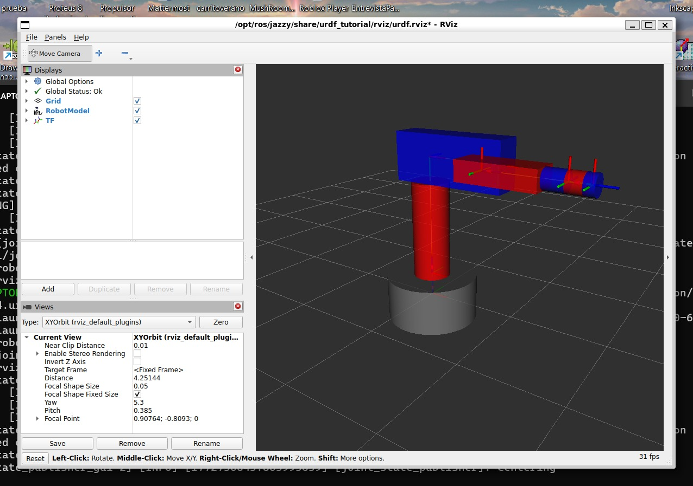
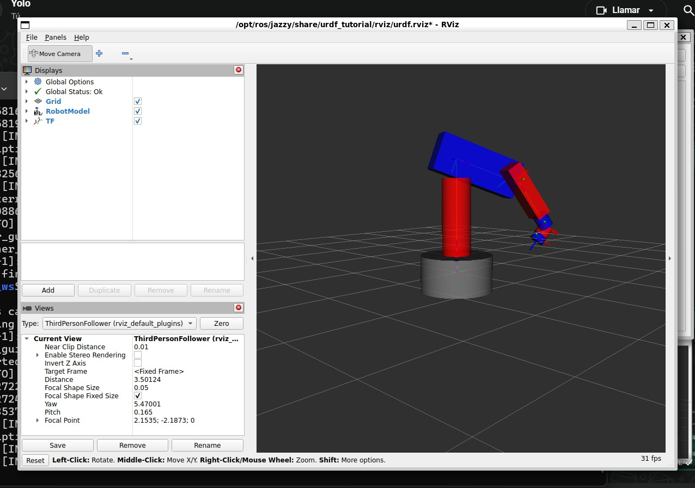
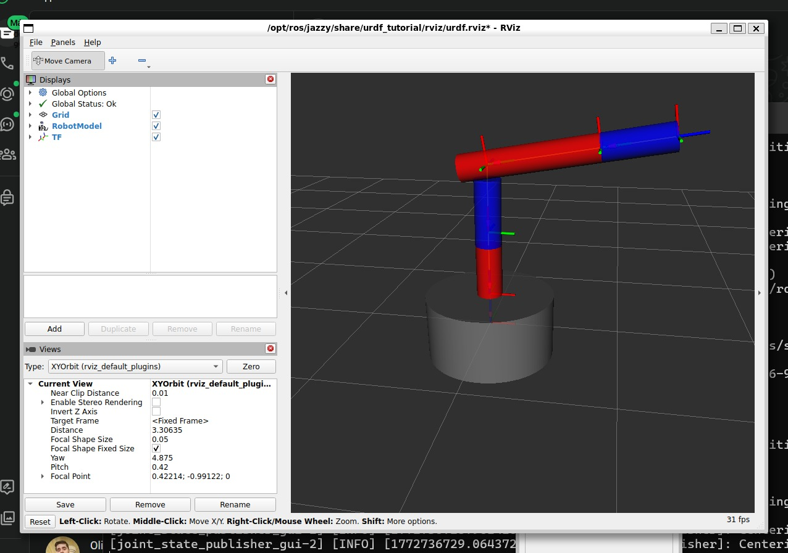
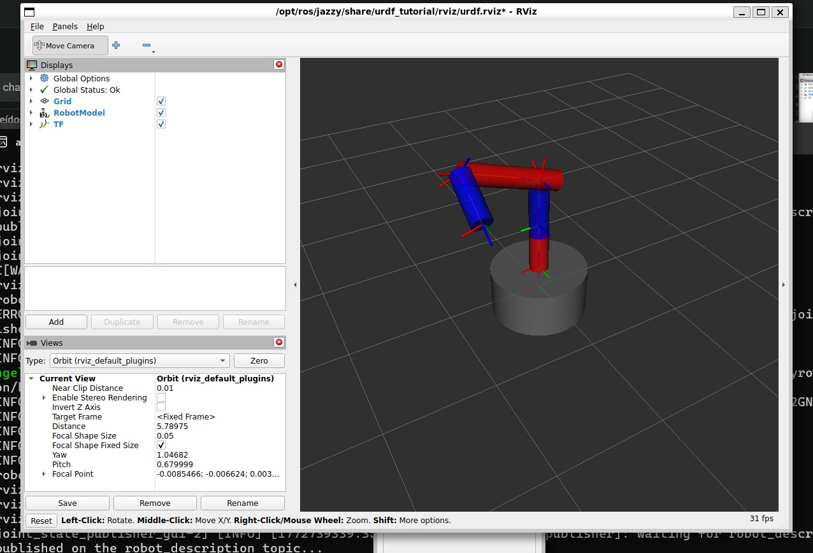

# 📚 URDF Robot Simulations

> In this assignment, I created different robotic structures using URDF (Unified Robot Description Format) and visualized them using RViz. The main focus was on creating and positioning coordinate systems (joints) and geometric shapes (links). We already calculated the forward kinematics in a previous task.

---

## 1) Summary

- **Homework Name:** URDF Robot Simulations
- **Author:** Angel Ivan Dominguez Cruz
- **Subject:** Applied Robotics
- **Date:** 05/03/2026

---

## 2) Objectives

- **General:** Understand how to build robot models using URDF. Learn how to define materials, place geometric shapes (links), and connect them with coordinate systems (joints) using rotations (rpy) and translations (xyz).

<p align="center">
  
</p>

---

## 3) Links and Joints

In URDF, a robot is made of Links (the solid parts like arms or bases) and Joints (the connections between the links that allow movement).

During these simulations, we defined:

- **Visual Geometries:** We used box and cylinder shapes to build the robot parts.
- **Materials:** We added colors like red, blue, green, and gray to make the robots easy to identify in the simulation.
- **Joints:** We used different types of joints to connect our coordinate systems:
    - ***revolute:*** Rotates like a standard motor.
    - ***fixed:*** Does not move, keeping the parts solid.
    - ***prismatic:*** Slides in a straight line.
- **Origins:** We calculated the xyz (position in meters) and rpy (rotation in radians: roll, pitch, yaw) to position every piece correctly in space.

---

## 4) Code 1: Box Robot with Prismatic Joint
This robot uses mostly box shapes. It features a revolute shoulder, a fixed connection, and a prismatic elbow that slides.

```xml
<?xml version = "1.0"?>
<robot name = "my_robot">
    <material name="blue">
                <color rgba="0 0 1 1"/>
    </material>
    <material name="gray">
                <color rgba="0.5 0.5 0.5 1"/>
    </material>
    <material name="red">
                <color rgba="1 0 0 1"/>
    </material>

    <joint name="base_shoulder_joint" type="revolute">
        <origin xyz="0 0 0.25" rpy="-1.57 0 0"/>
        <parent link="base_link"/>
        <child link="shoulder_link"/>
        <axis xyz="0 0 1"/>
        <limit lower="-4.71" upper="-1.57" effort="100" velocity="100"/>
    </joint>

    <joint name="shoulder_shoulder1_joint" type="fixed">
        <origin xyz="0 1 0" rpy="0 0 0"/>
        <parent link="shoulder_link"/>
        <child link="shoulder_link2"/>
    </joint>
    
    <joint name="shoulder_elbow_joint" type="prismatic">
        <origin xyz="0.5 0 0" rpy="-1.57 0 0"/>
        <parent link="shoulder_link"/>
        <child link="elbow_link"/>
        <axis xyz="0 0 1"/>
        <limit lower="-0.2" upper="0.2" effort="100" velocity="0.5"/>
    </joint>
    
    <joint name="elbow_wrist_joint" type="fixed">
        <origin xyz="0 0 1.4" rpy="0 0 0"/>
        <parent link="elbow_link"/>
        <child link="wrist_link"/>
    </joint>

    <link name = "base_link">
        <visual>
            <geometry>
                <box size="0.25 0.25 0.5"/>
            </geometry>
            <origin xyz="0 0 0" rpy="0 0 0"/>
            <material name="gray"/>
        </visual>
    </link>

    <link name = "shoulder_link">
        <visual>
            <geometry>
                <box size="0.1 1 0.1"/>
            </geometry>
            <origin xyz="0.05 0.5 0" rpy="0 0 0"/>
            <material name="red"/>
        </visual>
    </link>

    <link name = "shoulder_link2">
        <visual>
            <geometry>
                <box size="0.45 0.1 0.1"/>
            </geometry>
            <origin xyz="0.225 0 0" rpy="0 0 0"/>
            <material name="blue"/>
        </visual>
    </link>
        
    <link name = "elbow_link">
        <visual>
            <geometry>
                <box size="0.1 0.1 0.8"/>
            </geometry>
            <origin xyz="0 0 1" rpy="0 0 0"/>
            <material name="red"/>
        </visual>
    </link>

    <link name = "wrist_link">
    </link>
</robot>
```




---

## 5) Code 2: Basic Box Structure
This code defines a simple vertical structure using boxes and basic materials.

```xml
<?xml version="1.0"?>
<robot name="my_robot">
    
    <link name="base_link"> 
    <visual>
        <origin xyz="0 0 0.5" rpy="0 0 0" />
        <geometry>
            <box size="0.1 0.1 1" />
        </geometry>
        <material name="blue">
            <color rgba="0 0 1.0 1.0"/>
        </material>
    </visual>  
    </link>

    <link name="link1">
    <visual>
        <origin xyz="0 0 0.45" rpy="0 0 0" />
        <geometry>
            <box size="0.1 0.1 1.0" />
        </geometry>
        <material name="Red">
            <color rgba="1.0 0 0 1.0"/>
        </material>
    </visual>  
    </link>

    <link name="link2">
    <visual>
        <origin xyz="0 0 0.45" rpy="0 0 0" />
        <geometry>
            <box size="0.1 0.1 1.0" />
        </geometry>
        <material name="Red">
            <color rgba="1.0 0 0 0"/>
        </material>
    </visual>  
    </link>
    
    <link name="link3">
    <visual>
        <origin xyz="0 0 0.45" rpy="0 0 0" />
        <geometry>
            <box size= <!-- Note: Code excerpt cuts off here -->
```





---

## 6) Code 3: 7-DOF Cylindrical Robot
This is a complex robot with 7 links made entirely of cylinders and 6 revolute joints. We used green, red, and blue colors to identify the axes.

```xml
<?xml version="1.0"?>
<robot name="my_robot">
    
    <link name="base_link"> 
    <visual>
        <origin xyz="0 0 0.1" rpy="0 0 0" />
        <geometry>
            <cylinder radius="0.2" length="0.2"/>
        </geometry>
        <material name="blue">
            <color rgba="0 0 1.0 1.0"/>
        </material>
    </visual>  
    </link>

    <link name="link1">
    <visual>
        <origin xyz="0 0 0.4" rpy="0 0 0" />
        <geometry>
            <cylinder radius="0.1" length="0.9"/>
        </geometry>
        <material name="Red">
            <color rgba="1.0 0 0 1.0"/>
        </material>
    </visual>  
    </link>

    <link name="link2"> 
        <visual>
        <origin xyz="0 0 0" rpy="0 0 0" />
        <geometry>
            <cylinder radius="0.1" length="0.3"/>
        </geometry>
        <material name="green">
            <color rgba="0 1.0 0 1.0"/>
        </material>
    </visual> 
                <visual>
        <origin xyz="0.5 0 0" rpy="0 1.57 0" />
        <geometry>
            <cylinder radius="0.1" length="0.8"/>
        </geometry>
        <material name="Red">
            <color rgba="1.0 0 0 1.0"/>
        </material>
    </visual> 
    </link>

    <link name="link3"> 
            <visual>
        <origin xyz="0 0 0" rpy="0 0 0" />
        <geometry>
            <cylinder radius="0.1" length="0.3"/>
        </geometry>
        <material name="green">
            <color rgba="0 1.0 0 1.0"/>
        </material>
    </visual> 
    </link>

    <link name="link4"> 
            <visual>
        <origin xyz="0 0 0.5" rpy="0 0 0" />
        <geometry>
            <cylinder radius="0.1" length="1"/>
        </geometry>
        <material name="Red">
            <color rgba="1.0 0 0 1.0"/>
        </material>
    </visual> 
    </link>

    <link name="link5"> 
                <visual>
        <origin xyz="0 0 0" rpy="0 0 0" />
        <geometry>
            <cylinder radius="0.1" length="0.3"/>
        </geometry>
        <material name="green">
            <color rgba="0 1.0 0 1.0"/>
        </material>
    </visual> 
    </link>

    <link name="link6"> 
            <visual>
        <origin xyz="0 0 0.5" rpy="0 0 0" />
        <geometry>
            <cylinder radius="0.1" length="1"/>
        </geometry>
        <material name="Red">
            <color rgba="1.0 0 0 1.0"/>
        </material>
    </visual> 
    </link>
    <link name="link7"> 
                    <visual>
        <origin xyz="0 0 -0.025" rpy="0 0 0" />
        <geometry>
            <cylinder radius="0.12" length="0.05"/>
        </geometry>
        <material name="blue">
            <color rgba="0 0 1.0 1.0"/>
        </material>
    </visual>
    </link>

    <joint name="joint1" type="revolute">
        <parent link="base_link"/>
        <child link="link1"/>
        <origin xyz="0 0 0.2" rpy="0 0 0 "/>
        <axis xyz="0 0 1"/>
        <limit lower="-1.57" upper="1.57" effort="100" velocity="1"/>
    </joint>
    <joint name="joint2" type="revolute">
        <parent link="link1"/>
        <child link="link2"/>
        <origin xyz="0 0 1.0" rpy="-1.57 0 0 "/>
        <axis xyz="0 0 1"/>
        <limit lower="-1.57" upper="1.57" effort="100" velocity="1"/>
    </joint>
    <joint name="joint3" type="revolute">
        <parent link="link2"/>
        <child link="link3"/>
        <origin xyz="1 0 0" rpy="0 0 0 "/>
        <axis xyz="0 0 1"/>
        <limit lower="-1.57" upper="1.57" effort="100" velocity="1"/>
    </joint>
    <joint name="joint4" type="revolute">
        <parent link="link3"/>
        <child link="link4"/>
        <origin xyz="0 0 0" rpy="-1.57 0 -1.57 "/>
        <axis xyz="0 0 1"/>
        <limit lower="-1.57" upper="1.57" effort="100" velocity="1"/>
    </joint>
    <joint name="joint5" type="revolute">
        <parent link="link4"/>
        <child link="link5"/>
        <origin xyz="0 0 1" rpy="-1.57 0 -1.57 "/>
        <axis xyz="0 0 1"/>
        <limit lower="-1.57" upper="1.57" effort="100" velocity="1"/>
    </joint>
    <joint name="joint6" type="revolute">
        <parent link="link5"/>
        <child link="link6"/>
        <origin xyz="0 0 0" rpy="1.57 0 0 "/>
        <axis xyz="0 0 1"/>
        <limit lower="-1.57" upper="1.57" effort="100" velocity="1"/>
    </joint>
    <joint name="joint7" type="fixed">
        <parent link="link6"/>
        <child link="link7"/>
        <origin xyz="0 0 1.0" rpy="0 0 0 "/>
        <axis xyz="0 0 1"/>
        <limit lower="-1.57" upper="1.57" effort="100" velocity="1"/>
    </joint>
</robot>
```




---

## 7) Code 4: Mixed Shapes Robot
This robot mixes cylinders (for the base and shoulder) and boxes (for the elbow and wrist). It looks more like a traditional industrial robot arm.

```xml
<?xml version = "1.0"?>
<robot name = "my_robot">
    <material name="blue">
                <color rgba="0 0 1 1"/>
    </material>
    <material name="gray">
                <color rgba="0.5 0.5 0.5 1"/>
    </material>
    <material name="red">
                <color rgba="1 0 0 1"/>
    </material>

    <joint name="base_shoulder_joint" type="revolute">
        <origin xyz="0 0 0.25" rpy="0 0 0"/>
        <parent link="base_link"/>
        <child link="shoulder_link"/>
        <axis xyz="0 0 1"/>
        <limit lower="0" upper="3.14" effort="100" velocity="100"/>
    </joint>
    
    <joint name="shoulder_elbow_joint" type="revolute">
        <origin xyz="0 0 1.3" rpy="-1.57 0 0"/>
        <parent link="shoulder_link"/>
        <child link="elbow_link"/>
        <axis xyz="0 0 1"/>
        <limit lower="0" upper="3.14" effort="100" velocity="100"/>
    </joint>
    
    <joint name="elbow_wrist_joint" type="revolute">
        <origin xyz="0.8 0 0" rpy="0 0 0"/>
        <parent link="elbow_link"/>
        <child link="wrist_link"/>
        <axis xyz="0 0 1"/>
        <limit lower="0" upper="3.14" effort="100" velocity="100"/>
    </joint>

    <joint name="wrist_finger_joint" type="revolute">
        <origin xyz="0 0 -0.3" rpy="-1.57 0 -1.57"/>
        <parent link="wrist_link"/>
        <child link="finger_link"/>
        <axis xyz="0 0 1"/>
        <limit lower="0" upper="3.14" effort="100" velocity="100"/>
    </joint>

    <joint name="finger_nail_joint" type="revolute">
        <origin xyz="0 0 0.8" rpy="1.57 0 0"/>
        <parent link="finger_link"/>
        <child link="nail_link"/>
        <axis xyz="0 0 1"/>
        <limit lower="0" upper="3.14" effort="100" velocity="100"/>
    </joint>

    <joint name="nail_nail1_joint" type="revolute">
        <origin xyz="0 0 0" rpy="-1.57 0 0"/>
        <parent link="nail_link"/>
        <child link="nail1_link"/>
        <axis xyz="0 0 1"/>
        <limit lower="0" upper="3.14" effort="100" velocity="100"/>
    </joint>

    <joint name="nail1_tool_joint" type="fixed">
        <origin xyz="0 0 0.2" rpy="0 0 0"/>
        <parent link="nail1_link"/>
        <child link="tool_link"/>
    </joint>

    <link name = "base_link">
        <visual>
            <geometry>
                <cylinder radius="0.5" length="0.5"/>
            </geometry>
            <origin xyz="0 0 0" rpy="0 0 0"/>
            <material name="gray"/>
        </visual>
    </link>

    <link name = "shoulder_link">
        <visual>
            <geometry>
                <cylinder radius="0.2" length="1.05"/>
            </geometry>
            <origin xyz="0 0 0.525" rpy="0 0 0"/>
            <material name="red"/>
        </visual>
    </link>
        
    <link name = "elbow_link">
        <visual>
            <geometry>
                <box size="1.2 0.5 0.3"/>
            </geometry>
            <origin xyz="0.3 0 0" rpy="0 0 0"/>
            <material name="blue"/>
        </visual>
    </link>

    <link name = "wrist_link">
        <visual>
            <geometry>
                <box size="0.8 0.2 0.3"/>
            </geometry>
            <origin xyz="0.2 0 -0.3" rpy="0 0 0"/>
            <material name="red"/>
        </visual>
    </link>

    <link name = "finger_link">
        <visual>
            <geometry>
                <cylinder radius="0.1" length="0.2"/>
            </geometry>
            <origin xyz="0 0 0.7" rpy="0 0 0"/>
            <material name="blue"/>
        </visual> 
    </link>

    <link name = "nail_link">
        <visual>
            <geometry>
                <cylinder radius="0.1" length="0.15"/>
            </geometry>
            <origin xyz="0 0.075 0" rpy="-1.57 0 0"/>
            <material name="red"/>
        </visual> 
    </link>
    
    <link name = "nail1_link">
        <visual>
            <geometry>
                <cylinder radius="0.1" length="0.1"/>
            </geometry>
            <origin xyz="0 0 0.2" rpy="0 0 0"/>
            <material name="blue"/>
        </visual> 
    </link>

    <link name = "tool_link">
    </link>
</robot>
```




---

## 8) Code 5: Extended Cylindrical Robot
This robot is built entirely with cylinders, representing an extended robotic arm with small joints at the end.

```xml
<?xml version = "1.0"?>
<robot name = "my_robot">
    <material name="blue">
                <color rgba="0 0 1 1"/>
    </material>
    <material name="gray">
                <color rgba="0.5 0.5 0.5 1"/>
    </material>
    <material name="red">
                <color rgba="1 0 0 1"/>
    </material>

    <joint name="base_shoulder_joint" type="revolute">
        <origin xyz="0 0 0.25" rpy="0 0 0"/>
        <parent link="base_link"/>
        <child link="shoulder_link"/>
        <axis xyz="0 0 1"/>
        <limit lower="0" upper="3.14" effort="100" velocity="100"/>
    </joint>
    
    <joint name="shoulder_elbow_joint" type="revolute">
        <origin xyz="0 0 0.5" rpy="-1.57 0 0"/>
        <parent link="shoulder_link"/>
        <child link="elbow_link"/>
        <axis xyz="0 0 1"/>
        <limit lower="-3.14" upper="0" effort="100" velocity="100"/>
    </joint>

    <joint name="elbow_wrist_joint" type="revolute">
        <origin xyz="0.5 0 0" rpy="0 0 -1.57"/>
        <parent link="elbow_link"/>
        <child link="wrist_link"/>
        <axis xyz="0 0 1"/>
        <limit lower="0" upper="3.14" effort="100" velocity="100"/>
    </joint>

    <joint name="wrist_finger_joint" type="revolute">
        <origin xyz="0 0 0" rpy="-1.57 0 0"/>
        <parent link="wrist_link"/>
        <child link="finger_link"/>
        <axis xyz="0 0 1"/>
        <limit lower="0" upper="3.14" effort="100" velocity="100"/>
    </joint>

    <joint name="finger_nail_joint" type="revolute">
        <origin xyz="0 0 0.8" rpy="1.57 0 0"/>
        <parent link="finger_link"/>
        <child link="nail_link"/>
        <axis xyz="0 0 1"/>
        <limit lower="0" upper="3.14" effort="100" velocity="100"/>
    </joint>

    <joint name="nail_nail2_joint" type="revolute">
        <origin xyz="0 0 0" rpy="-1.57 0 0"/>
        <parent link="nail_link"/>
        <child link="nail2_link"/>
        <axis xyz="0 0 1"/>
        <limit lower="0" upper="3.14" effort="100" velocity="100"/>
    </joint>

    <joint name="nail2_nail3_joint" type="revolute">
        <origin xyz="0 0 0.5" rpy="0 0 0"/>
        <parent link="nail2_link"/>
        <child link="nail3_link"/>
        <axis xyz="0 0 1"/>
        <limit lower="0" upper="3.14" effort="100" velocity="100"/>
    </joint>

    <link name = "base_link">
        <visual>
            <geometry>
                <cylinder radius="0.5" length="0.5"/>
            </geometry>
            <origin xyz="0 0 0" rpy="0 0 0"/>
            <material name="gray"/>
        </visual>
    </link>

    <link name = "shoulder_link">
        <visual>
            <geometry>
                <cylinder radius="0.1" length="0.4"/>
            </geometry>
            <origin xyz="0 0 0.2" rpy="0 0 0"/>
            <material name="red"/>
        </visual>
    </link>
        
    <link name = "elbow_link">
        <visual>
            <geometry>
                <cylinder radius="0.1" length="0.5"/>
            </geometry>
            <origin xyz="0.15 0 0" rpy="0 -1.57 0"/>
            <material name="blue"/>
        </visual>
    </link>

    <link name = "wrist_link">
    </link>

    <link name = "finger_link">
        <visual>
            <geometry>
                <cylinder radius="0.1" length="1"/>
            </geometry>
            <origin xyz="0 0 0.3" rpy="0 0 0"/>
            <material name="red"/>
        </visual>
    </link>
   
    <link name = "nail_link">
    </link>
    
    <link name = "nail2_link">
        <visual>
            <geometry>
                <cylinder radius="0.1" length="0.5"/>
            </geometry>
            <origin xyz="0 0 0.25" rpy="0 0 0"/>
            <material name="blue"/>
        </visual>
    </link>

    <link name = "nail3_link">
    </link>
</robot>
```




---

## 9) Conclusions

- **General:** We built and visualized different robot models using URDF. By learning how to set the xyz (position) and rpy (rotation) values, we learned how to correctly position coordinate systems and attach solid shapes to them. This activity helped us understand the physical structure of a robot in ROS 2.

---