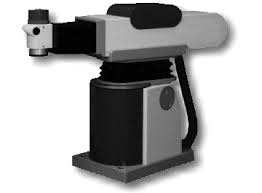

# 📚 Examples Of Robots By Morphology

> In this assigment I looked for different applications of the robots reviewed on class

---

## 1) Resume

- **Nombre del proyecto:** Examples Of Robots By Morphology  
- **Equipo / Autor(es):** Angel Ivan Dominguez Cruz 
- **Curso / Asignatura:** Applied Robotics
- **Fecha:** 27/01/2026 

---

## 2) Objectives

- **General:** Analyze and compare different industrial robot morphologies by examining thir kinematic structures, degrees of freedom and resulting workspaces.

  

---

## 3) Robots By Morphologies

- **Catesian Robot:** These robots operate on three axes (X, Y and Z) at 90 degree angles to each other. This structure allows the to cover a rectangular or cubical workspace. An example could be the TPA-E Series Gantry Robot from MAcron Dynamics. These robots are used for automated material handling (carrying heavy things) or assembling large components.

  

- **Cylindrical Robot:** These robots have a rotary base, a vertical linear axis and a horizontal linear axis. These robots create a cylindrical workspace. A real life example is the Seiko D-TRAN RT3300. These type of robots are less common today, but they are used for simple pick and place operations, machine tending and assembly tasks.

  

- **Polar Robot:** These robots have a rotary base, a rotary shoulder joint and a linear axis to extend and retract the arm. The workspace of these robots is a sphere. The Unimate (the first industrial robot) is the most famous example and it was used by General Motors in the 1960s for spot welding and die-casting.

  

- **Jointed-Arm Robot:** This is the most common type of industrial robot today. It features a series of rotary joints that emulates the structure of a human arm, providing an exceptional flexibility and a large and complex workspace. A great example could be de FANUC R-2000iC series. This robot is an articulated leading robot used in tasks like arc welding on automotive assembly lines, painting car bodies, handling materials, and performing complex assembly operations.

  

- **SCARA Robot:** SCARA stans for Selective Compliance Assembly Robot Arm. It has two parallel rotary joints that allow it to move quickly in the X-Y plane and a linear axis for Z-plane motion. My example is the Epson G-Series SCARA robots that are widely used in electronics industry for high-speed, precision assembly. Their speed and accuracy make them perfect for tasks like inserting components into printed circuit boards, sorting small parts, and packaging products where fast pick and place cycles are essential.

  

---