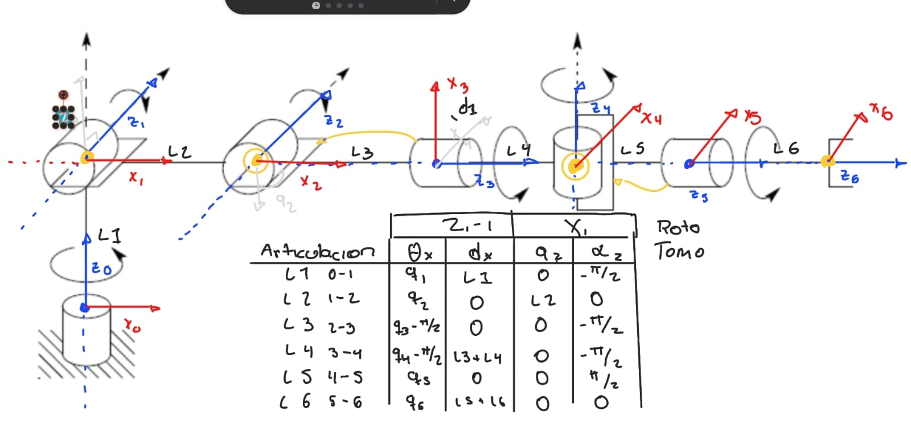

# 📚 Forward Kinematics

> In this assigment I solved different Forward Kinematics problems.

---

## 1) Summary

- **Homework Name:** Forward Kinematics
- **Author:** Angel Ivan Dominguez Cruz 
- **Subject:** Applied Robotics
- **Date:** 05/02/2026 

---

## 2) Objectives

- **General:** To analyze different robotic mechanisms by applying forward kinematics techniques, using Denavit–Hartenberg (DH) parameters and homogeneous transformation matrices to determine the position and orientation of the end-effector.

---

## 3) First Excercise

- **Explanation:** This exercise focuses on a simple articulated mechanism with rotational and prismatic components. The objective is to assign coordinate frames, define the DH parameters, and compute the transformation matrix to obtain the end-effector pose.

---

## 4) Second Excercise

- **Explanation:** This exercise presents a robot with multiple prismatic joints arranged in different directions. The goal is to analyze linear displacements and combine them using homogeneous transformations.

---

## 5) Third Excercise

- **Explanation:** This exercise involves a multi-joint robotic arm with several rotational axes. The task is to model a serial manipulator and determine its full kinematic chain.

---

## 6) Fourth Excercise

- **Explanation:** This exercise represents an industrial-type robotic arm with defined link lengths and joint rotation limits. The objective is to apply the DH convention to a realistic robot model and compute its workspace configuration.

---

## 7) Fifth Excercise

- **Explanation:** This exercise focuses on a complex industrial robot with multiple degrees of freedom and a defined working envelope. The task is to determine the forward kinematics and analyze the reachable workspace.

---