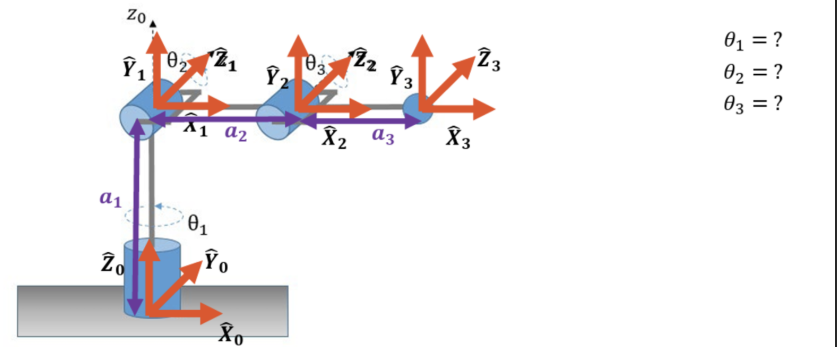
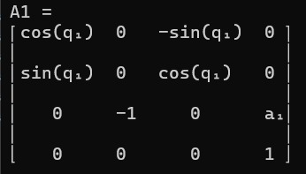
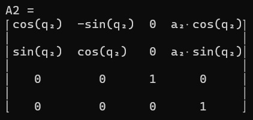
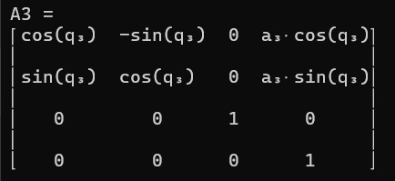
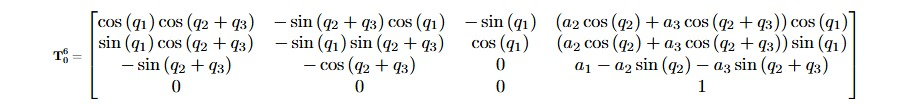
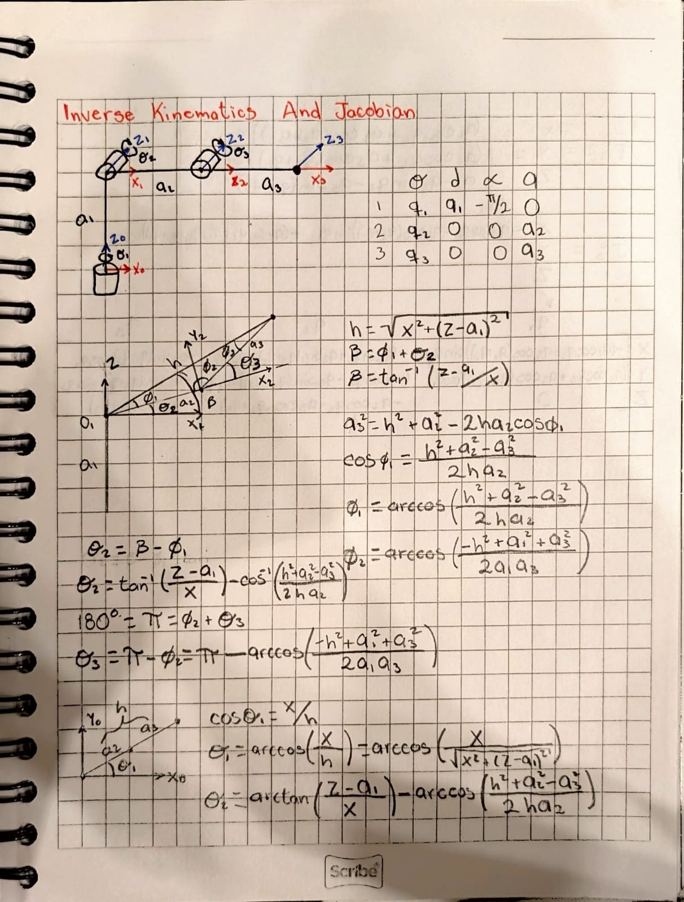
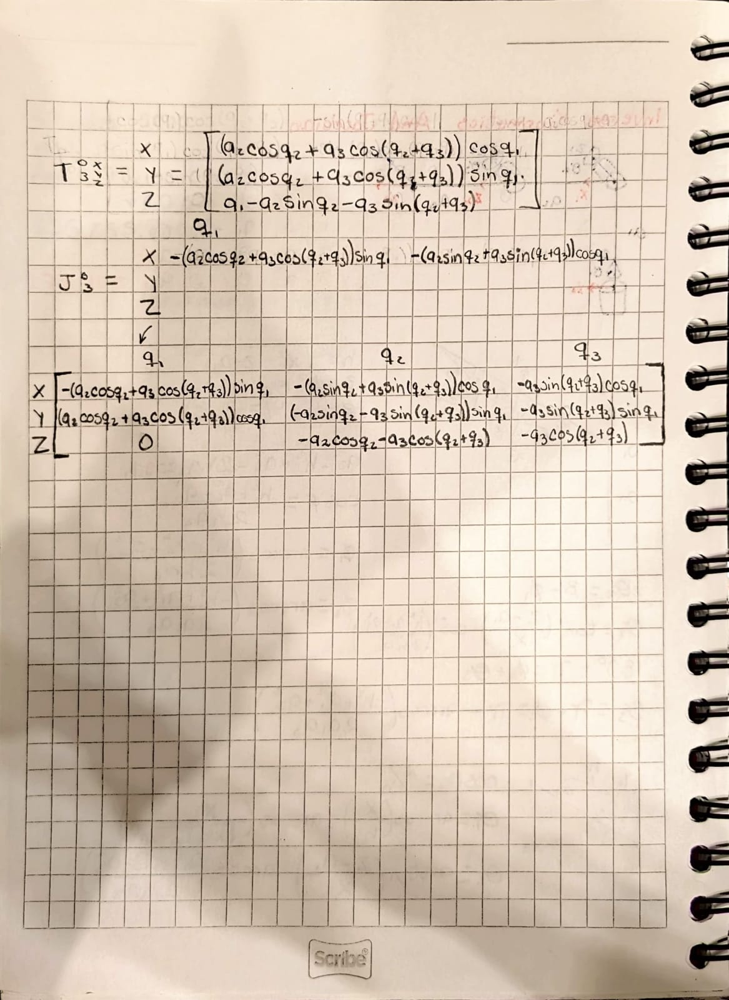

# 📚 Inverse Kinematics and Jacobian

> In this assignment I solved the Inverse Kinematics and calculated the Jacobian matrix for a 3-DOF articulated robotic arm.

---

## 1) Summary

- **Homework Name:** Inverse Kinematics and Jacobian
- **Author:** Angel Ivan Dominguez Cruz 
- **Subject:** Applied Robotics
- **Date:** 10/03/2026 

---

## 2) Objectives

- **General:** Analyze a 3-DOF articulated robotic mechanism by applying geometric methods to determine the Inverse Kinematics and computing its Jacobian matrix to relate joint velocities to the end effector's linear velocities.

---

## 3) 3-DOF Articulated Robot Excercise

- **Explanation:** This exercise focuses on a 3-Degree-of-Freedom (DOF) articulated robotic arm. First, the forward kinematics transformation matrix was established. Then, a geometric approach was used to find the inverse kinematics equations for θ1, θ2, and θ3. Finally, the Jacobian matrix was computed by differentiating the position vector equations with respect to each joint variable (q1, q2, q3).

### Forward Kinematics Matrices
Before jumping into the inverse kinematics, the position equations from the transformation matrix are needed. First, the individual transformation matrices for each link (A1, A2, A3) were defined based on the Denavit-Hartenberg parameters:

**Link 1 Transformation Matrix (A1$):**

**Link 2 Transformation Matrix (A2):**

**Link 3 Transformation Matrix (A3):**

By multiplying these individual matrices (T = A1 · A2 · A3), the complete forward kinematics transformation matrix is obtained:

### Inverse Kinematics Solution
Using geometric analysis (trigonometry and the law of cosines), the joint angles are solved based on a given end-effector position (x, y, z):

### Jacobian Matrix
The analytical Jacobian matrix was obtained by calculating the partial derivatives of the X, Y, and Z position equations with respect to the joint angles q1, q2, and q3:

---